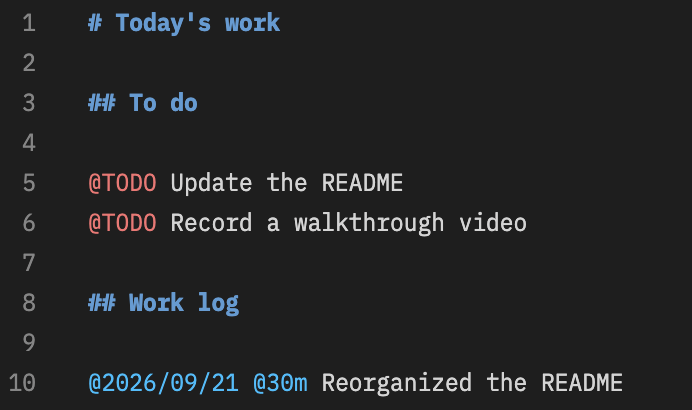
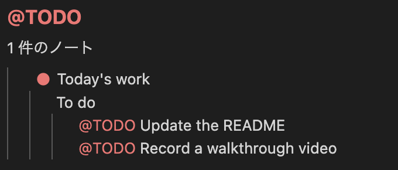
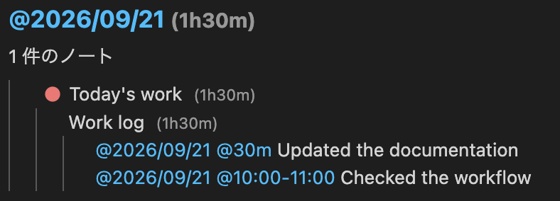

# fnote

[English](README.md)

**Markdownで書く。階層で整理する。タグで見つける。**

fnoteは、VS Codeの中でメモや作業記録を管理する拡張機能です。プロジェクト別のノートを階層で整理しながら、`@TODO` や日付タグで、複数のノートから必要な情報を取り出せます。

本文はいつものMarkdownエディタで編集します。ノートはMarkdownファイルとして保存され、開いているワークスペースを切り替えても同じノートを使えます。

- **階層ノート**：親子関係で整理し、ドラッグ＆ドロップで移動・並べ替え。
- **見出しアウトライン**：ノート内の見出しを一覧から開き、該当位置へ移動。
- **タグと検索**：タグ・キーワードから、ノートや本文の該当行を表示。
- **作業時間の集計**：日付と時間を書くだけで、日・月・年ごとの記録を確認。
- **色とアイコン**：タグごとに印や色を設定し、一覧でも見分けやすく。

ノート本文で `[[../旅行/]]` または `[](../旅行/)` と書くと、エディタから現在のノートを基準に `../旅行/index.md` を開けます。リンク先がディレクトリなら、末尾の `/` を省略した `[[../旅行]]` や `[](../旅行)` でも開けます。

## はじめに

VS Code **1.85以上**が必要です。利用するだけならNode.jsやPythonのインストールは不要です。

VS Codeの拡張機能画面で `fnote` を検索し、発行元が **maoren** の拡張機能をインストールしてください。VSIXファイルを利用する場合は、拡張機能画面の「…」から「VSIX からのインストール」を選びます。

## 最初のノートを作る

1. エクスプローラーを開き、**Fnote - List** の **＋** をクリックします。
2. ノート名に「今日の作業」と入力します。
3. 開いたノートに、次の例を入力して保存します（Windows / Linux：`Ctrl+S`、macOS：`Cmd+S`）。

```markdown
# 今日の作業

## やること

@TODO READMEを更新する
@TODO 操作動画を録画する

## 作業記録

@2026/09/21 @30m READMEの構成を整理した
```



4. **Fnote - Tags** の `TODO` をクリックします。タグを含むノートと本文行が表示されます。



5. 結果の本文行をクリックすると、元のノートのその位置へ移動できます。

これで「書く → タグで探す → 続きを編集する」という使い方を始められます。

## ノートを整理する

### 親子ノートと見出しを使い分ける

ノートを右クリックして「子ノートを追加」を選ぶと、親ノートの下に別のノートを作れます。たとえば「仕事」の下に「会議メモ」「調査メモ」をまとめられます。

ひとつのノートの中を分けたい場合は、Markdownの `##`〜`######` の見出しを使います。見出しもノート一覧に階層表示され、クリックして本文の該当位置を開けます。

### よく使う操作

| やりたいこと                 | 操作                                                    |
|------------------------------|---------------------------------------------------------|
| 最上位にノートを追加         | **Fnote - List** の **＋**                              |
| 子ノートを追加               | 親ノートを右クリック →「子ノートを追加」                |
| 名前を変更                   | ノートを選択して `F2`、または右クリック →「名前を変更」 |
| 移動・並べ替え               | ドラッグ＆ドロップ、または右クリックのメニュー          |
| ノートを削除                 | 右クリック →「削除」（子ノートを含めて確認）            |
| 一覧を展開・折りたたみ       | 各一覧のタイトルバーの展開・折りたたみボタン            |
| 開いたノートをまとめて閉じる | **Fnote - List** の「開いているノートをすべて閉じる」   |

ドラッグ先の**行の上端・下端**は前後への並べ替え、**中央**は子ノートへの移動、**一覧下部の空白**は最上位への移動です。親ノートを移動すると子ノートも一緒に移動します。

一覧のタイトルには、本文の最初の `# 見出し` を使います。本文で見出しを編集すると表示名が変わります。`F2`で名前を変更した場合は、保存先フォルダー名と最初の見出しの両方が変わります。

「すべて閉じる」は、fnoteのノートとタグ・検索の結果画面が対象です。ほかのファイルは閉じません。未保存のノートにはVS Codeの保存確認が表示され、閉じる操作をキャンセルすると結果画面も残ります。

## タグでノートを探す

本文に `@タグ名` を書くと、タグ一覧に反映されます。タグを事前に登録する必要はありません。

```markdown
@TODO 次の作業を決める
@参考 設定例を残しておく
@仕事/会議 次回の議題を整理する
```

`/` で区切ると、`仕事` → `会議` のように階層化されます。親タグをクリックすると子タグも含めて検索します。タグ名は大文字・小文字を区別するため、`@TODO` と `@todo` は別のタグです。

結果には、該当行だけでなく、その行が属する見出しや親ノートも表示します。どの話題のメモかを確認してから元の位置へ戻れます。タグの右側の数字は、子タグを含む一致ノート数です。

タグ一覧も、同じ階層内でドラッグして表示順を変更できます。

> コードブロックやインラインコード、メールアドレス内の `@`、`\@` でエスケープした文字はタグとして扱いません。

### キーワードでも検索できる

**Fnote - List** の虫眼鏡ボタン、またはコマンドパレットの **fnote: ノートを検索** を使います。ノート名と本文を、大文字・小文字を区別しない部分一致で検索します。

タグ検索とキーワード検索は同じ結果タブを使います。新しい検索を行うと、そのタブの内容が切り替わります。

## 日付と作業時間を記録する

日付と時間を**同じ行**に書くと、日付タグから作業時間を集計できます。

```markdown
# 作業記録

@2026/09/21 @30m ドキュメントを更新
@2026/09/21 @10:00-11:00 操作を確認
@2026/09/22 @1h 次の機能を検討
```

タグ一覧で `2026` → `09` → `21` を開いて選ぶと、この例では **1h30m** と表示されます。`09` を選ぶと月単位、`2026` を選ぶと年単位で集計できます。



| 書き方         | 意味                        |
|----------------|-----------------------------|
| `@2026/09/21`  | 日付（年4桁・月2桁・日2桁） |
| `@30m`         | 30分                        |
| `@1h`          | 1時間                       |
| `@10:00-11:00` | 開始時刻と終了時刻          |

時間は日付が1つだけ書かれた行で集計します。時間タグ自体はタグ一覧には表示されません。所要時間は整数と小文字の `m` / `h` で記述してください。

## 自分に合った設定にする

VS Codeの設定画面を開き、検索欄に **`@ext:maoren.fnote`** と入力すると、fnoteの設定を絞り込めます。

タグごとの設定は、コマンドパレットから **Preferences: Open User Settings (JSON)**（ユーザー設定をJSONで開く）を選ぶとまとめて編集できます。以下の例は、既存の `settings.json` の `{ ... }` の中へ追加してください。同じ設定がある場合は置き換えます。

### タグのアイコンと色を変える

```json
{
  "fnote.tagStyles": [
    {
      "tag": "TODO",
      "mark": "$(circle-filled-compact)",
      "markColor": "#FF5555",
      "color": "#FF5555"
    },
    { "tag": "完了", "mark": "✅", "color": "#66BB6A" },
    {
      "tag": "参考",
      "mark": "$(book)",
      "markColor": "#66AAFF",
      "excludeFromNoteMark": true
    },
    { "tag": "date", "mark": "$(calendar)", "markColor": "#66AAFF" }
  ]
}
```

- `tag`：対象のタグ名。`@` は付けません。`date` は日付タグ共通の設定です。
- `mark`：一覧のアイコン。絵文字や `$(book)` などのVS Code標準アイコンを指定できます。
  VS Code標準のアイコンは下記を参照してください。
  <https://microsoft.github.io/vscode-codicons/dist/codicon.html>
- `markColor`：標準アイコンの色。絵文字そのものの色は変わりません。
- `color`：本文・検索結果内のタグ文字色。
- `backgroundColor`：本文・検索結果内のタグ背景色。空文字で背景色なし。
- `excludeFromNoteMark`：`true` にすると、ノートのアイコンを選ぶ候補から除外します。タグ一覧には表示されます。

ノートに複数のタグがある場合、**配列の上にあるアイコン設定を優先**します。日付・時間タグはノートのアイコン候補には使いません。親ノートを折りたたむと、子孫のタグも含めてアイコンを選びます。

子タグにアイコンを設定しなければ、親タグのアイコンを引き継ぎます。文字色・背景色は完全一致、なければ最も近い `/` 区切りの親の設定を使います。子に独自の設定がある場合、そこで省略した文字色・背景色は全体の既定値になります。

`fnote.tagStyles` の既定値は次のとおりです。

```json
[
  { "tag": "FIX", "mark": "$(bug)", "color": "#f87171" },
  { "tag": "TODO", "mark": "$(circle-filled-compact)", "color": "#f87171" },
  { "tag": "date", "mark": "$(calendar)", "excludeFromNoteMark": true }
]
```

個別に設定していないタグには、既定のアイコンとタグ名に応じた自動色を使います。ユーザー設定で配列を指定すると既定の配列を置き換えるため、残したいタグ設定も同じ配列に含めてください。アイコンや色の変更は再起動せずに反映されます。

### タグ名を変えずにグループ化する

本文の `@TODO` と `@完了` を「状態」の下にまとめたいときは、次のように設定します。

```json
{
  "fnote.tagHierarchy": {
    "状態": ["TODO", "完了"]
  }
}
```

タグ一覧で「状態」を選ぶと、配下のタグに一致するノートをまとめて表示します。本文のタグ名を書き換える必要はありません。

### 保存先を変える

既定の保存先はホームフォルダー内の **`.fnote`** です。すべてのワークスペースで共通のノートを使用します。

**ユーザー設定**に絶対パス、または `~/` から始まるパスを指定し、コマンドパレットの **Developer: Reload Window**（ウィンドウの再読み込み）を実行してください。ワークスペース設定では保存先を変更できません。

```json
{
  "fnote.storagePath": "~/Documents/fnote"
}
```

Windowsの絶対パスは、たとえば `"C:/Users/your-name/Documents/fnote"` のように指定できます。

**保存先を変えても、既存のノートは自動で移動しません。** 編集中のノートを保存し、元の保存先のノートフォルダーを新しい場所へコピーしてから設定を変更してください。

### 主な設定の一覧

| 設定                       | 既定値                            | 用途                               |
|----------------------------|-----------------------------------|------------------------------------|
| `fnote.storagePath`        | `~/.fnote`                        | ノートの保存先                     |
| `fnote.untaggedNoteMark`   | `$(note)`                         | アイコン候補のタグがないノートの印 |
| `fnote.defaultTagMark`     | `$(circle-filled-compact)`        | 個別の印がないタグの既定アイコン   |
| `fnote.tagColor`           | `#00BFFF`                         | タグの既定文字色                   |
| `fnote.tagBackgroundColor` | 空文字                            | タグの既定背景色                   |
| `fnote.tagStyles`          | `FIX`・`TODO`・`date`（上記参照） | タグごとのアイコン・色・優先順位   |
| `fnote.tagHierarchy`       | `{}`                              | タグの親子関係                     |

## 保存とバックアップ

ノートはUTF-8のMarkdownファイルとして保存します。例として「仕事」の子ノートに「会議メモ」を作ると、次の構成になります。

```text
.fnote/
└── 仕事/
    ├── index.md
    └── 会議メモ/
        └── index.md
```

ノートの内容をバックアップするには、保存先フォルダーをコピーしてください。別端末への自動同期機能はありません。一覧の並び順はVS Code側で管理するため、フォルダーのコピーだけでは引き継がれません。

## 困ったとき

| 状況                             | 確認すること                                                                                       |
|----------------------------------|----------------------------------------------------------------------------------------------------|
| タグが出ない                     | `@タグ名` の形式か、コードの中に書いていないかを確認。必要に応じて一覧の更新ボタンを押します。     |
| 保存先を変えたらノートが見えない | 新しい保存先へノートをコピーしたか、ウィンドウを再読み込みしたかを確認します。                     |
| 期待したアイコンにならない       | `fnote.tagStyles` の順序と、`excludeFromNoteMark` を確認します。日付・時間タグは候補になりません。 |
| 時間が合計されない               | 同じ行に日付タグを1つ記述し、`@30m` など対応する形式で時間を書きます。                             |
