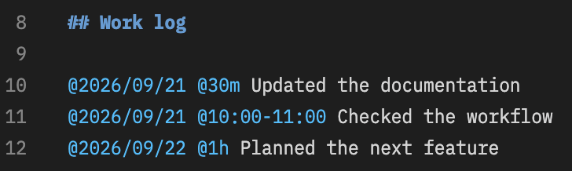

# fnote

[日本語](README.ja.md)

**Write in Markdown. Organize in a hierarchy. Find with tags.**

fnote is a VS Code extension for managing notes and work logs. Organize project notes in a hierarchy and use tags such as `@TODO` and dates to find the information you need across multiple notes.

Edit your notes in the familiar Markdown editor. Notes are saved as Markdown files and stay available when you switch workspaces.

- **Hierarchical notes**: Organize notes as parents and children, and move or reorder them with drag and drop.
- **Heading outline**: Open a heading from the note list to jump to its position in the note.
- **Tags and search**: Find notes and matching lines by tag or keyword.
- **Time tracking**: Add dates and durations to review your work by day, month, or year.
- **Colors and icons**: Give tags their own icons and colors to make them easier to recognize in lists.

In note text, `[[../旅行/]]` and `[](../旅行/)` link to `../旅行/index.md` relative to the current note in the editor. The trailing `/` is optional when the target is an existing directory: `[[../旅行]]` and `[](../旅行)` work too.

## Getting started

Requires **VS Code 1.85 or later**. You do not need to install Node.js or Python to use the extension.

Search for `fnote` in the VS Code Extensions view and install the extension published by **maoren**. To install a VSIX file, select **Install from VSIX...** from the **…** menu in the Extensions view.

## Create your first note

1. Open Explorer and click **＋** in **Fnote - List**.
2. Name the note “Today's work”.
3. Enter the following example in the note and save it (`Ctrl+S` on Windows / Linux, `Cmd+S` on macOS).

```markdown
# Today's work

## To do

@TODO Update the README
@TODO Record a walkthrough video

## Work log

@2026/09/21 @30m Reorganized the README
```


4. Click `TODO` in **Fnote - Tags**. Notes and lines containing the tag appear in the results.


5. Click a matching line to jump to that position in the original note.

You can now write a note, find it by tag, and pick up where you left off.

## Organize your notes

### Use child notes and headings

Right-click a note and select “Add Child Note” to create a separate note under it. For example, you can keep “Meeting notes” and “Research notes” under “Work”.

To divide a single note into sections, use Markdown headings from `##` to `######`. Headings also appear as a hierarchy in the note list. Click one to open its position in the note.

### Common actions

| Action                    | How                                                        |
| ------------------------- | ---------------------------------------------------------- |
| Add a top-level note      | Click **＋** in **Fnote - List**                           |
| Add a child note          | Right-click the parent note → “Add Child Note”             |
| Rename a note             | Select the note and press `F2`, or right-click → “Rename”  |
| Move or reorder notes     | Drag and drop, or use the context menu                     |
| Delete a note             | Right-click → “Delete” (confirmation includes child notes) |
| Expand or collapse a list | Use the expand / collapse buttons in the list's title bar  |
| Close all open notes      | Select “Close All Open Notes” in **Fnote - List**          |

Drop at the **top or bottom edge of a row** to place a note before or after it, in the **center** to make it a child, or in the **empty space below the list** to move it to the top level. Moving a parent note also moves its children.

The list uses the first `# Heading` in the note as its title. Editing that heading changes the displayed name. Renaming with `F2` changes both the folder name and the first heading.

“Close All” closes fnote notes and the tag / search results view. Other files stay open. VS Code asks whether to save any unsaved notes; if you cancel closing them, the results view also stays open.

## Find notes with tags

Write `@tag-name` in a note to add it to the tag list. No registration is needed.

```markdown
@TODO Decide on the next task
@Reference Keep a configuration example
@Work/Meetings Prepare the next agenda
```

Use `/` to create a hierarchy, such as `Work` → `Meetings`. Clicking a parent tag also searches its children. Tag names are case-sensitive: `@TODO` and `@todo` are different tags.

Results show matching lines along with their headings and parent notes, so you can see the context before returning to the original position. The number beside a tag is the count of matching notes, including its child tags.

You can also drag tags within the same level to change their display order.

> Tags are not recognized inside code blocks or inline code, in email addresses, or when escaped as `\@`.

### Search by keyword

Use the magnifying glass button in **Fnote - List**, or **fnote: Search Notes** in the Command Palette. Search matches parts of note names and content, ignoring case.

Tag and keyword searches share the same results tab. Each new search replaces the contents of that tab.

## Record dates and work time

Write a date and time on the **same line** to total your work time through date tags.

```markdown
# Work log

@2026/09/21 @30m Updated the documentation
@2026/09/21 @10:00-11:00 Checked the workflow
@2026/09/22 @1h Planned the next feature
```



Expand `2026` → `09` → `21` in the tag list and select the day. This example shows **1h30m**. Select `09` for the monthly total or `2026` for the yearly total.


| Format         | Meaning                                         |
| -------------- | ----------------------------------------------- |
| `@2026/09/21`  | Date (four-digit year, two-digit month and day) |
| `@30m`         | 30 minutes                                      |
| `@1h`          | 1 hour                                          |
| `@10:00-11:00` | Start and end times                             |

Time is counted only on lines containing exactly one date. Time tags themselves do not appear in the tag list. Use whole numbers and lowercase `m` / `h` for durations.

## Customize fnote

Open VS Code Settings and enter **`@ext:maoren.fnote`** in the search field to show fnote settings.

To edit tag settings together, select **Preferences: Open User Settings (JSON)** in the Command Palette. Add the examples below inside the `{ ... }` of your existing `settings.json`. Replace the setting if it already exists.

### Change tag icons and colors

```json
{
  "fnote.tagStyles": [
    {
      "tag": "TODO",
      "mark": "$(circle-filled-compact)",
      "markColor": "#FF5555",
      "color": "#FF5555"
    },
    { "tag": "Done", "mark": "✅", "color": "#66BB6A" },
    {
      "tag": "Reference",
      "mark": "$(book)",
      "markColor": "#66AAFF",
      "excludeFromNoteMark": true
    },
    { "tag": "date", "mark": "$(calendar)", "markColor": "#66AAFF" }
  ]
}
```

- `tag`: The tag name, without `@`. Use `date` for settings shared by date tags.
- `mark`: The icon shown in lists. Use an emoji or a built-in VS Code icon such as `$(book)`. See the [VS Code icon reference](https://microsoft.github.io/vscode-codicons/dist/codicon.html) for available icons.
- `markColor`: The color of a built-in icon. This does not change emoji colors.
- `color`: The tag's text color in notes and search results.
- `backgroundColor`: The tag's background color in notes and search results. An empty string means no background color.
- `excludeFromNoteMark`: Set to `true` to exclude the tag when choosing a note's icon. The tag still appears in the tag list.

When a note has multiple tags, **icon settings earlier in the array take priority**. Date and time tags are not used as note icons. When a parent note is collapsed, tags in its descendants are also considered.

A child tag inherits its parent's icon if it has no icon setting of its own. Text and background colors use an exact match, or the closest `/`-separated parent's settings if there is no exact match. If a child has its own settings, omitted text and background colors fall back to the global defaults.

The default value of `fnote.tagStyles` is:

```json
[
  { "tag": "FIX", "mark": "$(bug)", "color": "#f87171" },
  { "tag": "TODO", "mark": "$(circle-filled-compact)", "color": "#f87171" },
  { "tag": "date", "mark": "$(calendar)", "excludeFromNoteMark": true }
]
```

Tags without individual settings use the default icon and an automatically generated color based on the tag name. An array in your user settings replaces the default array, so include any tag settings you want to keep. Icon and color changes take effect without restarting.

### Group tags without renaming them

To group `@TODO` and `@Done` under “Status”, use:

```json
{
  "fnote.tagHierarchy": {
    "Status": ["TODO", "Done"]
  }
}
```

Selecting “Status” in the tag list shows notes matching any of its child tags. You do not need to change tag names in your notes.

### Change the storage location

The default location is **`.fnote`** in your home folder. The same notes are shared across all workspaces.

Set an absolute path or a path starting with `~/` in your **user settings**, then run **Developer: Reload Window** from the Command Palette. The storage location cannot be changed through workspace settings.

```json
{
  "fnote.storagePath": "~/Documents/fnote"
}
```

On Windows, you can use an absolute path such as `"C:/Users/your-name/Documents/fnote"`.

**Changing the storage location does not move existing notes automatically.** Save any notes you are editing, copy the note folders from the old location to the new one, and then change the setting.

### Key settings

| Setting                    | Default                               | Purpose                                          |
| -------------------------- | ------------------------------------- | ------------------------------------------------ |
| `fnote.storagePath`        | `~/.fnote`                            | Note storage location                            |
| `fnote.untaggedNoteMark`   | `$(note)`                             | Icon for notes with no eligible tag icon         |
| `fnote.defaultTagMark`     | `$(circle-filled-compact)`            | Default icon for tags without an individual icon |
| `fnote.tagColor`           | `#00BFFF`                             | Default tag text color                           |
| `fnote.tagBackgroundColor` | Empty string                          | Default tag background color                     |
| `fnote.tagStyles`          | `FIX`, `TODO`, and `date` (see above) | Tag icons, colors, and priority                  |
| `fnote.tagHierarchy`       | `{}`                                  | Parent-child relationships between tags          |

## Storage and backups

Notes are saved as UTF-8 Markdown files. For example, creating “Meeting notes” under “Work” produces this structure:

```text
.fnote/
└── Work/
    ├── index.md
    └── Meeting notes/
        └── index.md
```

To back up your note content, copy the storage folder. Automatic synchronization between devices is not available. List ordering is managed by VS Code, so copying the folder alone does not preserve it.

## Troubleshooting

| Issue                                               | What to check                                                                                                    |
| --------------------------------------------------- | ---------------------------------------------------------------------------------------------------------------- |
| A tag does not appear                               | Check that it uses the `@tag-name` format and is outside code. Refresh the list if needed.                       |
| Notes disappear after changing the storage location | Check that you copied the notes to the new location and reloaded the window.                                     |
| An unexpected icon appears                          | Check the order of `fnote.tagStyles` and `excludeFromNoteMark`. Date and time tags are excluded from note icons. |
| Time is not totaled                                 | Include exactly one date tag on the same line and use a supported time format, such as `@30m`.                   |

Report bugs and suggestions through [GitHub Issues](https://github.com/mahoutsukaino-deshi/fnote/issues). Include your VS Code and fnote versions and steps to reproduce the issue.
