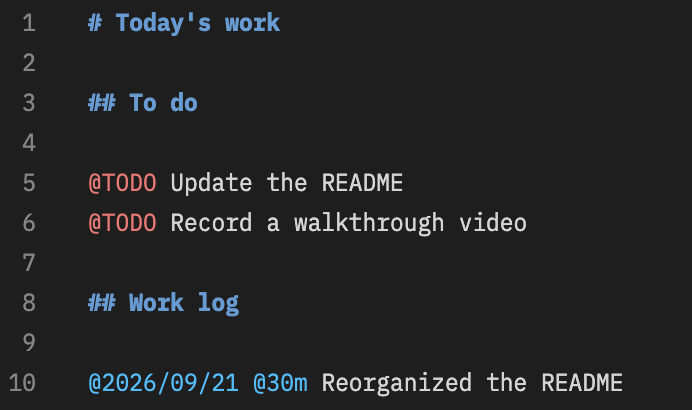
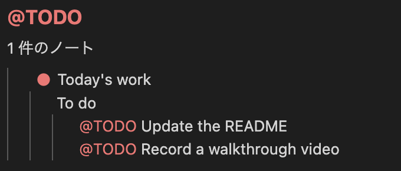
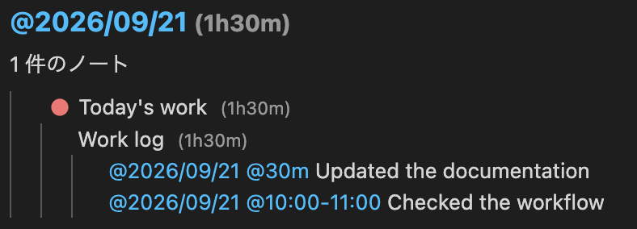

# fnote

**Write in Markdown. Organize in a hierarchy. Find with tags.**

fnote brings notes and work logs into VS Code. Keep project notes together and find tasks or records across notes without leaving your editor.

- **Organize naturally** with parent and child notes, headings, and drag and drop.
- **Find what you need** with `@TODO`, date tags, and keyword search.
- **Track your work** by writing dates and durations to see daily, monthly, and yearly totals.
- **Keep your files** as local Markdown with attachments. By default, the same notes are available across workspaces.

## How to use

### Create a note

1. Open **Fnote** in the activity bar.
2. Click **＋** in **Fnote - List** and enter a note name.
3. Write in the Markdown editor and save with `Cmd + S` on Mac or `Ctrl + S` on Windows.

```markdown
# Today's work

## Tasks
@TODO Update the README
@Work/Meetings Prepare the next agenda

## Work log
@2026/09/21 @30m Reorganized the documentation
```



### Find notes

Click `TODO` in **Fnote - Tags** to see matching notes and lines. Click a result to return to that position in the original note. The number beside a tag counts matching notes, including child tags and excluding archived notes.



Write `@tag-name` in your notes; no registration is needed. Use `/` for a hierarchy, such as `@Work/Meetings`. Selecting a parent tag includes its children. Tags are case-sensitive and are ignored inside code, in email addresses, or when escaped as `\@`. Drag tags within the same level to reorder them.

For keyword search, click the magnifying glass in **Fnote - List**. It searches note names and content, ignoring case, and includes archived notes.

### Organize and navigate

Right-click a note for **Add Child Note**, **Rename**, **Move**, and **Delete**. Drag a note to a row’s center to make it a child, to its top or bottom edge to reorder it, or below the list to move it to the top level. Moving a parent also moves its children.

Use `##`–`######` headings to divide a note into sections; click a heading in the list to jump to it. The first `#` heading supplies the displayed title. **Rename** changes both that heading and the folder name.

These shortcuts work while the note list has focus:

| Action                                        | Mac               | Windows    |
|-----------------------------------------------|-------------------|------------|
| Create a note (a child if a note is selected) | `Cmd + N`         | `Ctrl + N` |
| Rename a note or attachment                   | `F2`              | `F2`       |
| Delete a note or attachment                   | `Cmd + Backspace` | `Delete`   |
| Change selection                              | `↑` / `↓`         | `↑` / `↓`  |
| Open the selected note or attachment          | `Enter`           | `Enter`    |

Arrow keys change the selection without opening another note. `Enter` opens the item while keeping focus in the list. The open note’s background and the keyboard selection outline are shown separately.

The tag list also keeps focus after opening tag results, so `↑` / `↓` can be used to move between tags without reaching for the mouse.

Use the list’s title-bar buttons to expand or collapse everything, or close all open fnote notes and search results.

## Useful features

### Work-time totals

Write exactly one date and a duration or time range on the **same line**:

```markdown
@2026/09/21 @30m Updated the documentation
@2026/09/21 @10:00-11:00 Checked the workflow
@2026/09/22 @1h Planned the next feature
```

Select `2026` → `09` → `21` in the tag list to see **1h30m** for that day. Select the month or year for a wider total.



Use `@YYYY/MM/DD` for dates, `@30m` or `@1h` for whole-number durations, and `@10:00-11:00` for time ranges. Time tags themselves do not appear in the tag list.

Unfinished entries such as `@10:00` or `@10:00-` appear under **Incomplete time tags**, so you can find and complete them. They do not contribute to totals.

Set `fnote.dateTagSort` to `"time"` to group tag results by date and sort individual entry lines by time across notes. This uses the same display as selecting a date year or month; regular tags use a date on the same line when present. Each entry is followed by its note and Markdown heading path, separated by ` / `, with duration totals. Click an entry to jump to its source line. Lines containing multiple times use the earliest time; untimed lines appear last within their date, and lines without a date appear in a final **No date** group. The **Sort** button in tag results switches between Notes and Time dynamically; `fnote.dateTagSort` provides the initial mode. The default `"note"` keeps the note-list order.

Timeline entries display date and time first, followed by other tags such as `@TODO` and remaining text. Leading Markdown list markers are hidden.

### Attachments and links

Use **Add Attachment** in a note’s context menu, or hold **Shift** while dropping external files onto a note in the list or into its Markdown editor. The list also accepts folders. For editor drops, keep `editor.dropIntoEditor.enabled` enabled and choose **Copy attachments into fnote** if prompted.

Attachments appear beneath their note and can be opened, renamed, deleted, or moved to another note by dragging within the list. Internal note and attachment drags do not require Shift.

Link to another note with `[[../Travel]]` or `[Travel plans](../Travel)`. Use `[](#title)` to jump to a heading in the current note, or add the fragment to another note link. Ctrl+Click follows the link. Directory links open the `index.md` inside them. Supported relative Markdown and wiki links are updated when notes are moved or renamed.

Links display an icon and their label or destination. Place the cursor on a link to edit its original syntax; the saved Markdown stays unchanged.

### Archive finished notes

Choose **Archive** from a note’s context menu to toggle its state. **✓ Archive** means it is archived; the default icon is a gray archive icon.

If the note has children, a confirmation asks whether to apply the change to the note and all its descendants. Changing a child does not change its parent.

Archived notes stay in the note list but are excluded from tag results, tag counts, and work-time totals shown through tags. Their state is saved in a `.status` file in each note folder and follows the note when copied or moved.

## Settings

Open VS Code Settings and search for **`@ext:maoren.fnote`**. For the JSON examples below, run **Preferences: Open User Settings (JSON)** and add the settings inside your existing `{ ... }`.

### Icons and colors

Use `fnote.tagStyles` for individual tags. Icons accept text, emoji, or VS Code icon names such as `$(book)`.

The available VS Code icons are listed in the [VS Code Codicons](https://microsoft.github.io/vscode-codicons/dist/codicon.html) reference.

```json
{
  "fnote.tagStyles": [
    { "tag": "TODO", "mark": "$(circle-filled-compact)", "markColor": "#FF5555", "color": "#FF5555" },
    { "tag": "Done", "mark": "✅", "color": "#66BB6A" },
    { "tag": "Reference", "mark": "$(book)", "excludeFromNoteMark": true },
    { "tag": "Incomplete time tags", "mark": "$(clock)", "color": "#fbbf24", "excludeFromNoteMark": true },
    { "tag": "date", "mark": "$(calendar)", "excludeFromNoteMark": true }
  ],
  "fnote.headingMark": "#",
  "fnote.headingMarkColor": "#808080",
  "fnote.archiveMark": "$(archive)",
  "fnote.archiveColor": "#808080"
}
```

`markColor` controls the icon color; `color` and `backgroundColor` control tag text and background. `date` applies to date tags. `excludeFromNoteMark` keeps a tag out of note-icon selection while leaving it in the tag list.

Earlier entries have priority when choosing a note icon; date and time tags are excluded. Child tags inherit their parent’s icon unless overridden. Setting `fnote.tagStyles` replaces the default array, so include entries you want to keep. Appearance changes take effect without restarting.

| Setting                                          | Purpose                                            |
|--------------------------------------------------|----------------------------------------------------|
| `fnote.untaggedNoteMark`                         | Icon for notes without an eligible tag (`$(note)`) |
| `fnote.defaultTagMark`                           | Default tag icon (`$(circle-filled-compact)`)      |
| `fnote.tagColor` / `fnote.tagBackgroundColor`    | Default tag text and background colors             |
| `fnote.headingMark` / `fnote.headingMarkColor`   | Mark and color for Markdown headings in the note list (`#`, `#808080`) |
| `fnote.dateTagSort`                              | Initial tag result order: `note` or `time`      |
| `fnote.linkMark`                                 | Link icon (`$(link-external)`)                     |
| `fnote.attachmentMark` / `fnote.attachmentColor` | Attachment icon (`$(attach)`) and color            |
| `fnote.archiveMark` / `fnote.archiveColor`       | Archive icon (`$(archive)`) and color (`#808080`)  |

### Group tags

Group existing tags without changing the note text:

```json
{
  "fnote.tagHierarchy": {
    "Status": ["TODO", "Done"]
  }
}
```

Selecting **Status** shows notes matching either child tag.

### Storage and backups

Notes are stored as `<note folder>/index.md`, with child notes and attachments in the same folder. The default root is **`~/.fnote`**, shared across workspaces.

To use the current workspace, set:

```json
{
  "fnote.storagePath": "${workspace}/.fnote"
}
```

You can also use `~/Documents/fnote` or an absolute path such as `C:/Users/your-name/Documents/fnote`. `${workspace}` and `${workspaceFolder}` refer to the first workspace folder. After changing the setting, run **Developer: Reload Window**.

Existing notes are not moved automatically: save them and copy their folders to the new location before switching. To back up notes, attachments, archive states, and note ordering, copy the storage folder, including `.status` files. The root `.status` stores top-level note ordering, while each note's `.status` stores the ordering of its direct child notes.
